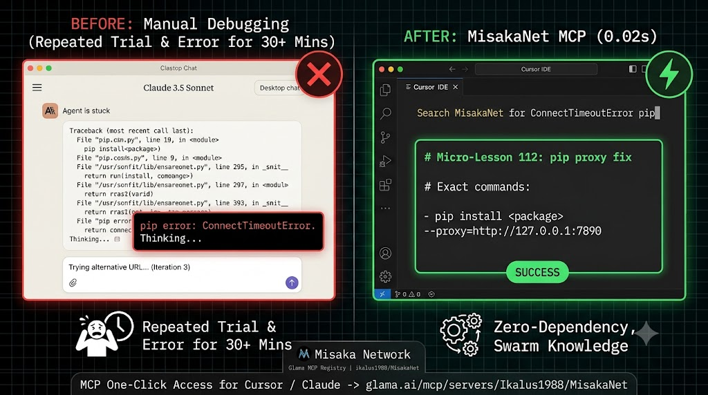

[English](README.md) | [日本語](README.ja.md) | [简体中文](README.zh-CN.md)

# MisakaNet

mcp-name: io.github.Ikalus1988/misakanet

> **Stop debugging the same error twice.** MisakaNet searches 417+ failure lessons so an agent skips the
> bugs someone already paid for, instead of rediscovering them one session at a time.
>
> Agent-native interfaces: [MCP server](https://misakanet.org/mcp) (7 tools), WebMCP (browser
> `navigator.modelContext`), `llms.txt` / `llms-full.txt`, and A2A discovery through
> `.well-known/agent-card.json`.

  

  <em>Core</em>
  &nbsp;&nbsp;
  
  
  
  
  

  <em>Install</em>
  &nbsp;&nbsp;
  
  
  
  
  
  
  

  <em>Ecosystem</em>
  &nbsp;&nbsp;
  
  
  
  
  
  

---